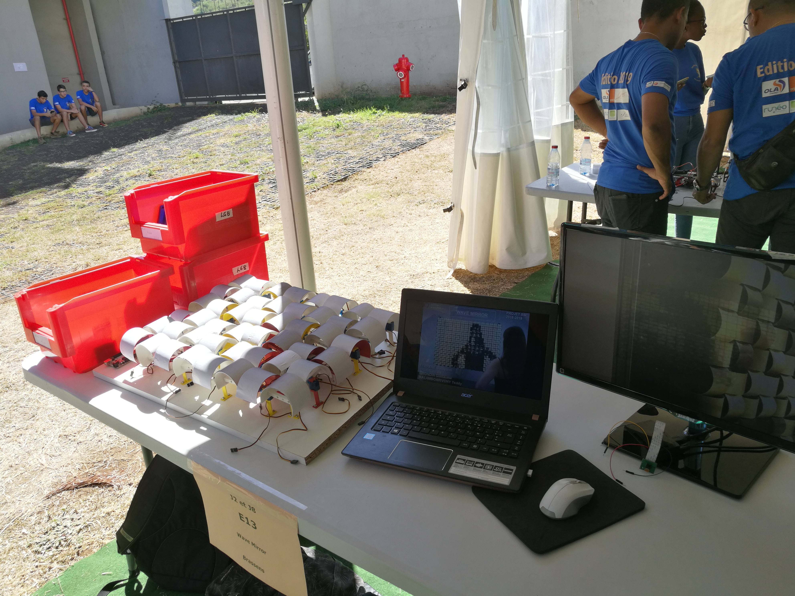
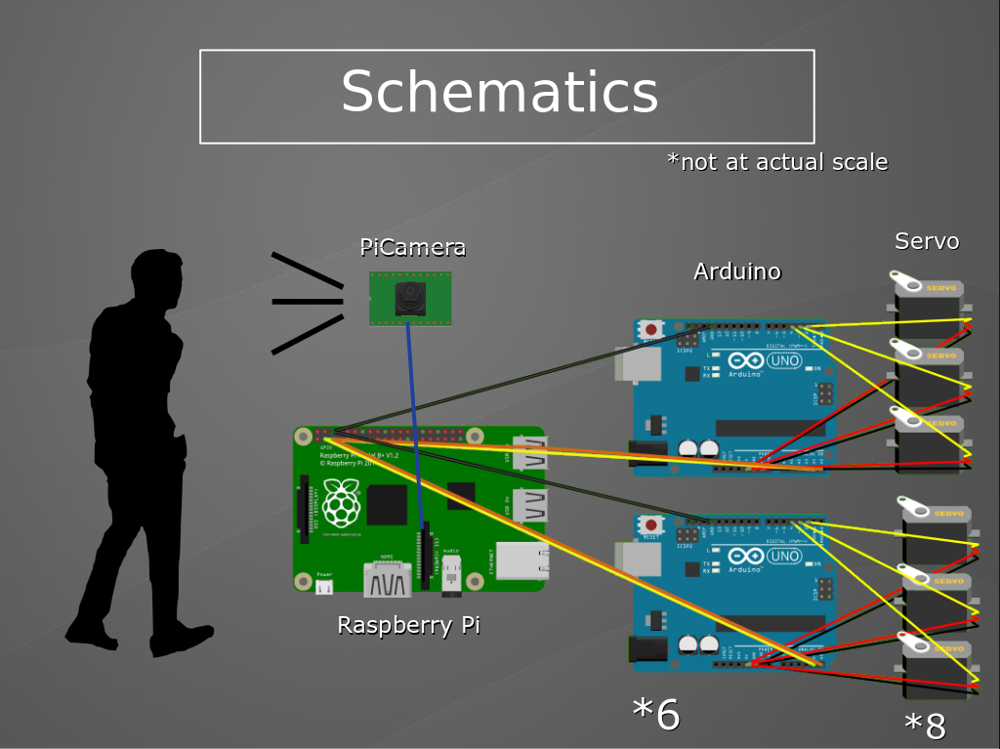

# WaveMirror

This repository is for an highschool project in Lycée George Brassens (St-Denis, Réunion, french overseas island in the Indian Ocean). It is based on [Daniel Rozin's](https://www.smoothware.com/danny/) [Weave Mirror](https://smoothware.com/danny/weavemirror.html) with a 8x6 grid of servo-motors. This project help the students grow with interesting software and technologies such as Arduino, Raspberry Pi, SolidWorks or Scilab. It also uses a 3D Printer for moving parts that will be controlled by Servos.

A photo taken by a PiCamera is treated by a Raspberry Pi, which send the average grayscale values of the picture in 48 squares of pixels (8x6) to 6 Arduino via I2C communication. Each Arduino treats a row, converting these values in degrees (0-255 grayscale to 0-180 degrees) to control 8 servo-motors. The servo-motors rotate 3D printed white-to-black cylinders, which then displays the picture back to the user, making it act like a mirror. 

##### 
Source: [Daniel Rozin Weave Mirror (32x24 grid)](https://smoothware.com/danny/weavemirror.html)

##### 
Our stand at "Les Olympiades de l'Ingenieur 2019"

## Material used :
- 1x [Raspberry Pi Model 3B+](https://www.raspberrypi.org/products/raspberry-pi-3-model-b/)
- 1x [PiCamera Rev 1.3](https://www.amazon.com/Raspberry-Pi-Camera-Module-Megapixel/dp/B01ER2SKFS)
- 6x [Arduino UNO](https://store.arduino.cc/arduino-uno-rev3)
- 48x [HS-55 Servo-motors](https://www.servocity.com/hitec-hs-55-servo)
- 48x Semi-cylinders contrasted from white to black (3D Printed)

The cylinders were designed and 3D printed by a student of the group project, you can find the files used in the SolidWorks directory. 

We originally intended to make it bigger (12x10), but unfortunately we lacked time and ressources. We also wanted to use [Sparkfun PWM Shields](https://www.sparkfun.com/products/10615) to connect the Servos to the Arduinos, but dropped this idea because it took too much of our time without working, and we learned that they don't actually work with I2C. 
If you want to make this project, we recommend trying it with the [Adafruit PWM Shield](https://www.adafruit.com/product/1411) (16 pins), or the [Arduino Mega](https://store.arduino.cc/arduino-mega-2560-rev3) (48 pins) to use less hardware.

The 4 students making this project have each been assigned to work on a different part :
- Scilab modelisation & simulation (RALAMBOARIVONY Teddy)
- Solidworks modelisation & 3D printing (GRONDIN Guillaume)
- Arduino connections & servos (FERRERE Guillyann)
- Raspberry Pi & Arduino code (PAUSE Julien) <-- Author of this repository

Since the author of this repository is responsible for the Raspberry Pi part, you'll find more ressources in that directory. However, don't hesitate to ask if you have any questions about other parts. 

Feel free to contact me about this project at : julien.pause17@gmail.com
